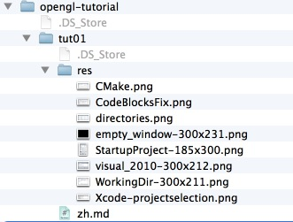

OpenGL Tutorials
=============

社区维护的OpenGL教程网站。 http://opengl.zilongshanren.com

所有网站由jeklly自动生成，但是大家在贡献的时候要按照规则来.

##前言

翻译教程的顺序为http://www.opengl-tutorial.org/ 和 http://www.arcsynthesis.org/gltut/. 经过本人的实践，我想这两个网站上面的教程同时翻译，每周翻译各翻译一篇。

最后翻译 http://www.scratchapixel.com/ 上面的教程。


##计划
第一阶段：

每周翻译两篇文章：

opengl-tutorial上面有18篇教程，gltut上面有17篇。 暂定为9周（计划两个月翻译完，留一周为review时间）。


第二阶段:
翻译完scratchapixel上面的教程。这个教程系列比较多，等第一阶段的任务完成之后再详细计划。

##贡献方式

采用github的fork & pull request的方式，如果不是很熟悉的可以参考[这个网站](http://happycasts.net/episodes?tag_id=2)上面的教程。

##目录结构

opengl-tutorial.org上面的文章全部放在opengl-tutorial目录下面。
里面的教程按照tut01-tutxx的顺序编号，具体如下图所示:



###如何添加一篇新的教程
（注：以添加opengl-tutorial.org上面的一篇教程tut02为例:）

- 第一步
    	
在opengl-tutorial目录下面新建一个文件夹：tut02.

然后新建一个res目录，用来存放该文章的所有图片和源码。

最后新建一个zh.md文件。


- 第二步
		
打开_layouts/default.html,然后找到

```
   <div class="container">
      <div class="row">
        <div class="span3">
          <ul id="menu" class="nav nav-list" data-spy="affix">
            <li class="nav-header">OpenGL教程</li>
            <li data-section=""><a href="/">Home</a></li>
            <li class="nav-header">opengl-tutorial.org</li>
            <li data-section="opengl-tutorial/tut01"><a href="/opengl-tutorial/tut01/zh.html">第一课:新建一个窗口</a></li>
            <li class="nav-header">SUPPORT</li>
            <li><a href="mailto:guanghui.qu@cocos2d-x.org">Contact Support</a></li>
          </ul>
        </div>

```

此时，新添加一个li，并按照里面的链接修改data-section和href里面的值，让它们都指向我们新建的文章。

最终修改好的代码是这样子的:

```
   <div class="container">
      <div class="row">
        <div class="span3">
          <ul id="menu" class="nav nav-list" data-spy="affix">
            <li class="nav-header">OpenGL教程</li>
            <li data-section=""><a href="/">Home</a></li>
            <li class="nav-header">opengl-tutorial.org</li>
            <li data-section="opengl-tutorial/tut01"><a href="/opengl-tutorial/tut01/zh.html">第一课:新建一个窗口</a></li>
            <li data-section="opengl-tutorial/tut02"><a href="/opengl-tutorial/tut02/zh.html">第二课:画第一个三角形</a></li>
            <li class="nav-header">SUPPORT</li>
            <li><a href="mailto:guanghui.qu@cocos2d-x.org">Contact Support</a></li>
          </ul>
        </div>

```


- 第三步

在tut02/zh.md的最开头，添加下列代码:

```
---
layout: default
title: 第二课： 画第一个三角形
section: opengl-tutorial/tut02
---
<style>
  h3 {
	margin: 20px 0px 10px 0px;
  }
</style>
```

（注意：里面的section一定要和_layouts/default.html里面指定的data-section一致。）

然后，按照markdown的语法把tut02/zh.md里面的文章写完就ok了。

最后，记得加上免责申明和原文链接。范文如下：

```
免责申明（必读！）：本网站提供的所有教程的翻译原稿均来自于互联网，仅供学习交流之用，切勿进行商业传播。同时，转载时不要移除本申明。如产生任何纠纷，均与本博客所有人、发表该翻译稿之人无任何关系。谢谢合作！

原文链接：http://whateverdomainis.com
```


##贡献人列表
(注：所有贡献人的名字都会在此列出，欢迎大家踊跃参与。)

[子龙山人](http://www.zilongshanren.com)
