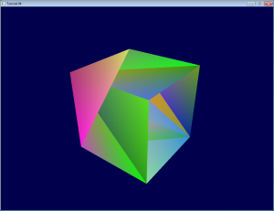
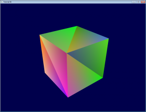

<style>
  h3 {
	margin: 20px 0px 10px 0px;
  }
</style>

免责申明（必读！）：本网站提供的所有教程的翻译原稿均来自于互联网，仅供学习交流之用，切勿进行商业传播。同时，转载时不要移除本申明。如产生任何纠纷，均与本博客所有人、发表该翻译稿之人无任何关系。谢谢合作！

原文链接：[http://www.opengl-tutorial.org/beginners-tutorials/tutorial-4-a-colored-cube/](http://www.opengl-tutorial.org/beginners-tutorials/tutorial-4-a-colored-cube/)

原译文链接: [http://www.opengl-tutorial.org/zh-hans/beginners-tutorials-zh/tutorial-4-a-colored-cube-zh/](http://www.opengl-tutorial.org/zh-hans/beginners-tutorials-zh/tutorial-4-a-colored-cube-zh/)

## 第四课：彩色立方体

欢迎来到第四课！你将学到：

- 画立方体，代替单调的三角形
- 加上绚丽的色彩
- 学习深度缓存（Z-Buffer）

### 画立方体

立方体有六个方形表面，而OpenGL只支持画三角形，因此需要画12个三角形，每面两个。我们用定义三角形顶点的方式来定义这些顶点。

```
// Our vertices. Tree consecutive floats give a 3D vertex; Three consecutive vertices give a triangle.
// A cube has 6 faces with 2 triangles each, so this makes 6*2=12 triangles, and 12*3 vertices
static const GLfloat g_vertex_buffer_data[] = {
-1.0f,-1.0f,-1.0f, // triangle 1 : begin
-1.0f,-1.0f, 1.0f,
-1.0f, 1.0f, 1.0f, // triangle 1 : end
1.0f, 1.0f,-1.0f, // triangle 2 : begin
-1.0f,-1.0f,-1.0f,
-1.0f, 1.0f,-1.0f, // triangle 2 : end
1.0f,-1.0f, 1.0f,
-1.0f,-1.0f,-1.0f,
1.0f,-1.0f,-1.0f,
1.0f, 1.0f,-1.0f,
1.0f,-1.0f,-1.0f,
-1.0f,-1.0f,-1.0f,
-1.0f,-1.0f,-1.0f,
-1.0f, 1.0f, 1.0f,
-1.0f, 1.0f,-1.0f,
1.0f,-1.0f, 1.0f,
-1.0f,-1.0f, 1.0f,
-1.0f,-1.0f,-1.0f,
-1.0f, 1.0f, 1.0f,
-1.0f,-1.0f, 1.0f,
1.0f,-1.0f, 1.0f,
1.0f, 1.0f, 1.0f,
1.0f,-1.0f,-1.0f,
1.0f, 1.0f,-1.0f,
1.0f,-1.0f,-1.0f,
1.0f, 1.0f, 1.0f,
1.0f,-1.0f, 1.0f,
1.0f, 1.0f, 1.0f,
1.0f, 1.0f,-1.0f,
-1.0f, 1.0f,-1.0f,
1.0f, 1.0f, 1.0f,
-1.0f, 1.0f,-1.0f,
-1.0f, 1.0f, 1.0f,
1.0f, 1.0f, 1.0f,
-1.0f, 1.0f, 1.0f,
1.0f,-1.0f, 1.0f
};
```

OpenGL的缓冲区由一些标准的函数（glGenBuffers, glBindBuffer, glBufferData, glVertexAttribPointer）来创建、绑定、填充和配置；这些可参阅第二课。绘制的函数调用也没变，只需改绘制的点的个数：

```
// Draw the triangle !
glDrawArrays(GL_TRIANGLES, 0, 12*3); // 12*3 indices starting at 0 -> 12 triangles -> 6 squares
```

这段代码，有几点要解释：

- 现在为止，三维模型都是固定的：要改就要改源码，重新编译，然后祈望不会错。我们将在第七课中学习如何加载动态模型。
- 实际上，每个顶点至少被写了三次（在以上代码中搜索“-1.0f,-1.0f,-1.0f”看看）。这是可怕的内存浪费。我们将在第九课中学习怎样优化。

现在，你有了画一个白色立方体的所有必备条件。让着色器运行起来，至少试试吧:)

### 添加颜色 Adding colors

颜色，从概念上说，像极了位置：它就是数据。OpenGL中，它们都是“属性”。事实上，之前已在glEnableVertexAttribArray()和glVertexAttribPointer()用过属性设置了。现在我们加上颜色属性，代码很相似的。

首先，声明颜色：每个顶点一个RGB（红绿蓝）三元组。这里用随机的方式生成的，所以结果可能看起来不那么好；但你可以调整得更好，例如：把顶点的位置作为颜色值。

```
// One color for each vertex. They were generated randomly.
static const GLfloat g_color_buffer_data[] = {
0.583f, 0.771f, 0.014f,
0.609f, 0.115f, 0.436f,
0.327f, 0.483f, 0.844f,
0.822f, 0.569f, 0.201f,
0.435f, 0.602f, 0.223f,
0.310f, 0.747f, 0.185f,
0.597f, 0.770f, 0.761f,
0.559f, 0.436f, 0.730f,
0.359f, 0.583f, 0.152f,
0.483f, 0.596f, 0.789f,
0.559f, 0.861f, 0.639f,
0.195f, 0.548f, 0.859f,
0.014f, 0.184f, 0.576f,
0.771f, 0.328f, 0.970f,
0.406f, 0.615f, 0.116f,
0.676f, 0.977f, 0.133f,
0.971f, 0.572f, 0.833f,
0.140f, 0.616f, 0.489f,
0.997f, 0.513f, 0.064f,
0.945f, 0.719f, 0.592f,
0.543f, 0.021f, 0.978f,
0.279f, 0.317f, 0.505f,
0.167f, 0.620f, 0.077f,
0.347f, 0.857f, 0.137f,
0.055f, 0.953f, 0.042f,
0.714f, 0.505f, 0.345f,
0.783f, 0.290f, 0.734f,
0.722f, 0.645f, 0.174f,
0.302f, 0.455f, 0.848f,
0.225f, 0.587f, 0.040f,
0.517f, 0.713f, 0.338f,
0.053f, 0.959f, 0.120f,
0.393f, 0.621f, 0.362f,
0.673f, 0.211f, 0.457f,
0.820f, 0.883f, 0.371f,
0.982f, 0.099f, 0.879f
};
```

缓冲区的创建、绑定和填充方法和之前一样：

```
GLuint colorbuffer;
glGenBuffers(1, &colorbuffer);
glBindBuffer(GL_ARRAY_BUFFER, colorbuffer);
glBufferData(GL_ARRAY_BUFFER, sizeof(g_color_buffer_data), g_color_buffer_data, GL_STATIC_DRAW);
```

配置也一样：

```
// 2nd attribute buffer : colors
glEnableVertexAttribArray(1);
glBindBuffer(GL_ARRAY_BUFFER, colorbuffer);
glVertexAttribPointer(
1, // attribute. No particular reason for 1, but must match the layout in the shader.
3, // size
GL_FLOAT, // type
GL_FALSE, // normalized?
0, // stride
(void*)0 // array buffer offset
);
```
		
现在，顶点着色器中，我们已能访问这个额外的缓冲区：

```
// Notice that the "1" here equals the "1" in glVertexAttribPointer
layout(location = 1) in vec3 vertexColor;
```

本例将不会在顶点着色器里做花哨的玩意，只是简单地过渡到片断着色器：

```
// Output data ; will be interpolated for each fragment.
out vec3 fragmentColor;

void main(){

[...]

// The color of each vertex will be interpolated
// to produce the color of each fragment
fragmentColor = vertexColor;
}
```

片断着色器中，要再次声明片断颜色：

```
// Interpolated values from the vertex shaders
in vec3 fragmentColor;
```

…然后把它的值赋给输出颜色：

```
// Output color = color specified in the vertex shader,
// interpolated between all 3 surrounding vertices
color = fragmentColor;
```

于是得到：



额，好丑。为了搞清楚，我们先看看各画一个看起来“远”和“近”的三角形，会发生什么：


似乎挺好。现在画“远”的三角形：


它遮住了“近”三角形！它本应该画在“近”三角形后面的！我们的立方体就有这个问题：一些理应被遮挡的面，因为绘制时间晚，实际可见。我们将用深度缓存（Z-Buffer）算法解决它。

*便签1*
: 如果你没发现问题，把相机放到(4,3,-3)试试

*便签2*
: 如果“类似于位置，颜色是一种属性”，那为什么颜色要声明 vec3 fragmentColor，而位置不需要？实际上，位置有点特殊：它是唯一必须赋初值的（否则OpenGL不知道在哪画三角形）。所以在顶点着色器里， gl_Position是内置变量。

### 深度缓存（Z-Buffer）The Z-Buffer

该问题的解决方案是：在缓冲区中存储每个片断的深度（即“Z”值）；而每次画片断时，先确保当前片断确实比先前画的片断更近。

你可以自己实现，但让硬件自己去做更简单：

```
// Enable depth test
glEnable(GL_DEPTH_TEST);
// Accept fragment if it closer to the camera than the former one
glDepthFunc(GL_LESS);
```

这就解决之前所有问题了。
 


### 练习

- 在不同的位置画立方体和三角形。你需要生成两个MVP矩阵，在主循环中做两次绘制调用，但只需一个着色器。

- 自己生成颜色值。一些提示：随机生成，使每次运行颜色都不同；依据顶点的位置；将前二者结合；或其他的创新想法。若你不了解C，参考以下语法：

```
static GLfloat g_color_buffer_data[12*3*3];
for (int v = 0; v < 12*3 ; v++){
g_color_buffer_data[3*v+0] = your red color here;
g_color_buffer_data[3*v+1] = your green color here;
g_color_buffer_data[3*v+2] = your blue color here;
}
```

- 完成上面习题后，试令颜色在每帧都改变。你需要在每一帧都调用glBufferData。请确保已先绑定（glBindBuffer）了合适的缓冲区！


`教程看不懂？教程不够详细？有错别字？` [请点击这里提交问题，我们一定会竭诚为您服务！](https://github.com/andyque/opengl-tutorials/issues/new)
