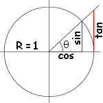

<style>
  h3 {
	margin: 20px 0px 10px 0px;
  }
</style>

免责申明（必读！）：本网站提供的所有教程的翻译原稿均来自于互联网，仅供学习交流之用，切勿进行商业传播。同时，转载时不要移除本申明。如产生任何纠纷，均与本博客所有人、发表该翻译稿之人无任何关系。谢谢合作！

原文链接：[http://www.opengl-tutorial.org/beginners-tutorials/tutorial-6-keyboard-and-mouse/](http://www.opengl-tutorial.org/beginners-tutorials/tutorial-6-keyboard-and-mouse/)

原译文链接: [http://www.opengl-tutorial.org/zh-hans/beginners-tutorials-zh/tutorial-6-keyboard-and-mouse-zh/](http://www.opengl-tutorial.org/zh-hans/beginners-tutorials-zh/tutorial-6-keyboard-and-mouse-zh/)

## 第六课：键盘和鼠标


欢迎来到第六课！

我们将学习如何通过鼠标和键盘来移动相机，就像在第一人称射击游戏中一样。

### 接口

这段代码在整个课程中多次被使用，因此把它单独放在一个文件中：common/controls.cpp，然后在common/controls.hpp中声明函数接口，这样tutorial06.cpp就能使用它们了。

和前节课比，tutorial06.cpp里的代码变动很小。主要的变化是：每一帧都计算MVP（投影视图矩阵）矩阵，而不像之前那样只算一次。现在把这段代码加到主循环中：

```
do{

    // ...

    // Compute the MVP matrix from keyboard and mouse input
    computeMatricesFromInputs();
    glm::mat4 ProjectionMatrix = getProjectionMatrix();
    glm::mat4 ViewMatrix = getViewMatrix();
    glm::mat4 ModelMatrix = glm::mat4(1.0);
    glm::mat4 MVP = ProjectionMatrix * ViewMatrix * ModelMatrix;

    // ...
}
```

这段代码需要3个新函数：

- computeMatricesFromInputs()读键盘和鼠标操作，然后计算投影视图矩阵。这就是奇妙所在。
- getProjectionMatrix()返回计算好的投影矩阵。
- getViewMatrix()返回计算好的视图矩阵。

这只是一种实现方式，当然，如果你不喜欢这些函数，勇敢地去改写它们。

来看看controls.cpp在做什么。

### 实际代码

我们需要几个变量。

```
// position
glm::vec3 position = glm::vec3( 0, 0, 5 );
// horizontal angle : toward -Z
float horizontalAngle = 3.14f;
// vertical angle : 0, look at the horizon
float verticalAngle = 0.0f;
// Initial Field of View
float initialFoV = 45.0f;

float speed = 3.0f; // 3 units / second
float mouseSpeed = 0.005f;

FoV is the level of zoom. 80° = very wide angle, huge deformations. 60° – 45° : standard. 20° : big zoom.
```

首先根据输入，重新计算位置，水平角，竖直角和视场角（FoV）；再由它们算出视图和投影矩阵。

#### 方向

读取鼠标位置是容易的：

```
// Get mouse position
int xpos, ypos;
glfwGetMousePos(&xpos, &ypos);
```

我们需要把光标放到屏幕中心，否则它将很快移到屏幕外，导致无法响应。

```
// Reset mouse position for next frame
glfwSetMousePos(1024/2, 768/2);
```

注意：这段代码假设窗口大小是1024*768，这不是必须的。你可以用glfwGetWindowSize来设定窗口大小。

计算观察角度：

```
// Compute new orientation
horizontalAngle += mouseSpeed * deltaTime * float(1024/2 - xpos );
verticalAngle   += mouseSpeed * deltaTime * float( 768/2 - ypos );
```

从右往左阅读这几行代码：

- 1024/2 – xpos表示鼠标离窗口中心点的距离。这个值越大，转动角越大。
- float(…)是浮点数转换，使乘法顺利进行
- mouseSpeed用来加速或减慢旋转，可以随你调整或让用户选择。
- += : 如果你没移动鼠标，1024/2-xpos的值为零，horizontalAngle+=0不改变horizontalAngle的值。如果你用的是”=”，每帧视角都被强制转回到原始方向，这就不好了。

现在，在世界坐标系下计算一个向量，代表视线方向。

```
// Direction : Spherical coordinates to Cartesian coordinates conversion
glm::vec3 direction(
    cos(verticalAngle) * sin(horizontalAngle),
    sin(verticalAngle),
    cos(verticalAngle) * cos(horizontalAngle)
);
```

这是一种标准计算，如果你不了解余弦和正弦，下面有一个简短的解释：



上面的公式，只是上图在三维空间下的推广。

我们想算出相机的『上方向』。『上方向』不一定是Y轴正方向：你俯视时，『上方向』实际上是水平的。这里有一个例子，位置相同，视点相同的相机，却有不同的『上方向』。

本例中，唯一不变的是，『相机的右边』这个方向始终取水平方向。你可以试试：保持手臂水平伸直，向正上方看、向下看；向这之间的任何方向看（译注：『看』立刻产生视线方向）。现在定义『右方向』向量：因为是水平的，故Y坐标为零，X和Z值就像上图中的一样，只是角度旋转了90度，或Pi/2弧度。

```
// Right vector
glm::vec3 right = glm::vec3(
    sin(horizontalAngle - 3.14f/2.0f),
    0,
    cos(horizontalAngle - 3.14f/2.0f)
);
```

我们有一个『右方向』和一个视线方向，或者说是『前方向』。『上方向』垂直于这两者。一个很有用的数学工具可以让三者的联系变得简单：叉乘。

```
// Up vector : perpendicular to both direction and right
glm::vec3 up = glm::cross( right, direction );
```

叉乘是在做什么呢？很简单，回忆第三课讲到的右手定则。第一个向量是大拇指；第二个是食指；叉乘的结果就是中指。十分方便。

#### 位置

代码十分直观。顺便说下，我用上/下/右/左键而不用wsad；是因为我的azerty键盘中，美式键盘的awsd键位处实际上是zqsd。qwerZ键盘其实又不一样了，更别提韩国键盘了。我甚至不知道韩国人民用的键盘是什么布局，但我猜想肯定很不一样。

```
// Move forward
if (glfwGetKey( GLFW_KEY_UP ) == GLFW_PRESS){
    position += direction * deltaTime * speed;
}
// Move backward
if (glfwGetKey( GLFW_KEY_DOWN ) == GLFW_PRESS){
    position -= direction * deltaTime * speed;
}
// Strafe right
if (glfwGetKey( GLFW_KEY_RIGHT ) == GLFW_PRESS){
    position += right * deltaTime * speed;
}
// Strafe left
if (glfwGetKey( GLFW_KEY_LEFT ) == GLFW_PRESS){
    position -= right * deltaTime * speed;
}
```

这里唯一特别的是deltaTime。你不会希望每帧偏移1单元的，原因很简单：

- 如果你有一台快电脑，每秒能跑60帧，你每秒移动60*speed个单位。
- 如果你有一台慢电脑，每秒能跑20帧，你每秒移动20*speed个单位。

电脑性能不能成为速度不稳的借口；你需要通过“前一帧到现在的时间”或“时间间隔（deltaTime）”来控制移动步长。

- 如果你有一台快电脑，每秒能跑60帧，你每帧移动1/60*speed个单位，每秒移动1*speed个单位。
- 如果你有一台慢电脑，每秒能跑20帧，你每帧移动1/20*speed个单位，每秒移动1*speed个单位。

这就好多了。deltaTime很容易算：

```
double currentTime = glfwGetTime();
float deltaTime = float(currentTime - lastTime);
```

#### 视场角

为了好玩，我们可以把视场角绑定到鼠标滚轮，作为简陋的缩放功能：

```
float FoV = initialFoV - 5 * glfwGetMouseWheel();
```

#### 计算矩阵

计算矩阵已经很直观了。使用和前面几乎一样的函数，仅参数不同。

```
// Projection matrix : 45° Field of View, 4:3 ratio, display range : 0.1 unit <-> 100 units
ProjectionMatrix = glm::perspective(FoV, 4.0f / 3.0f, 0.1f, 100.0f);
// Camera matrix
ViewMatrix       = glm::lookAt(
    position,           // Camera is here
    position+direction, // and looks here : at the same position, plus "direction"
    up                  // Head is up (set to 0,-1,0 to look upside-down)
);
```

### 结果  


#### 隐藏面消除

现在可以自由移动鼠标，你会注意到：如果鼠标移动到立方体里面，多边形仍然会被显示。这看起来理所当然，实则可以优化。事实上，在常见应用中，你从来不会处于立方体内。

有一个思路是让GPU检查相机在三角形的后面还是前面。如果在前面，显示该三角形；如果相机在三角形后面，且不在网格（网格必须是封闭的）内部，那么必有其他三角形在相机前面，故不显示该三角形。没有人会注意到什么，除了一切都会变快：三角形平均少了两倍！

更妙的是，检查起来还很简单：GPU计算三角形的法向（用叉乘，记得吧？），然后检查这个法向是否朝向相机。

不幸的是这样做有代价：三角形的方向是隐式的。这意味着如果你在缓冲区中交换两个顶点，可能会产生洞。但一般来说，它值得做一点额外工作。一般你只要在三维建模软件中点击“反转法向”（实际是交换两个顶点，从而反转法向），一切就正常了。

开启隐藏面消除是很轻松的：

```
// Cull triangles which normal is not towards the camera
glEnable(GL_CULL_FACE);
```

### 练习

- 限制verticalAngle，使之不能颠倒方向
- 创建一个相机，使它绕着物体旋转 ( position = ObjectCenter + ( radius * cos(time), height, radius * sin(time) ) )；然后将半径/高度/时间的变化绑定到键盘/鼠标上，诸如此类。
- 玩得开心！


`教程看不懂？教程不够详细？有错别字？` [请点击这里提交问题，我们一定会竭诚为您服务！](https://github.com/andyque/opengl-tutorials/issues/new)
