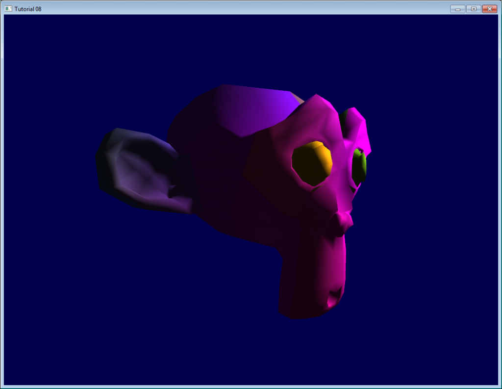
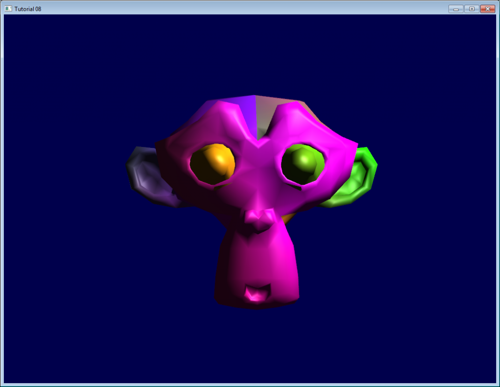

<style>
  h3 {
	margin: 20px 0px 10px 0px;
  }
</style>

免责申明（必读！）：本网站提供的所有教程的翻译原稿均来自于互联网，仅供学习交流之用，切勿进行商业传播。同时，转载时不要移除本申明。如产生任何纠纷，均与本博客所有人、发表该翻译稿之人无任何关系。谢谢合作！

原文链接：[http://www.opengl-tutorial.org/beginners-tutorials/tutorial-8-basic-shading/](http://www.opengl-tutorial.org/beginners-tutorials/tutorial-8-basic-shading/)

原译文链接: [http://www.opengl-tutorial.org/zh-hans/beginners-tutorials-zh/tutorial-8-basic-shading-zh/](http://www.opengl-tutorial.org/zh-hans/beginners-tutorials-zh/tutorial-8-basic-shading-zh/)

## 第八课：基础光照模型

在第八课中，我们将学习光照模型的基础知识。包括：

- 物体离光源越近会越亮
- 直视反射光时会有高亮（镜面反射）
- 当光没有直接照射物体时，物体会更暗（漫反射）
- 用环境光简化计算

不包括：

- 阴影。这是个宽阔的主题，大到需要专题教程了。
- 类镜面反射（包括水）
- 任何复杂的光与物质的相互作用，像次表面散射（比如蜡）
- 各向异性材料（比如拉丝的金属）
- 追求真实感的，基于物理的光照模型
- 环境光遮蔽（在洞穴里会更黑）
- 颜色溢出（一块红色的地毯会映得白色天花板带红色）
- 透明度
- 任何种类的全局光照（它包括了上面的所有）

总而言之：只讲基础。

### 法向

过去的几个教程中我们一直在处理法向，但是并不知道法向到底是什么。

#### 三角形法向

一个平面的法向是一个长度为1并且垂直于这个平面的向量。    
一个三角形的法向是一个长度为1并且垂直于这个三角形的向量。通过简单地将三角形两条边进行叉乘计算（向量a和b的叉乘结果是一个同时垂直于a和b的向量，记得？），然后归一化：使长度为1。伪代码如下：

```
triangle ( v1, v2, v3 )
edge1 = v2-v1
edge2 = v3-v1
triangle.normal = cross(edge1, edge2).normalize()
```

不要将法向(normal)和normalize()函数混淆。Normalize()函数是让一个向量（任意向量，不一定必须是normal）除以其长度，从而使新长度为1。法向(normal)则是某一类向量的名字。

#### 顶点法向

引申开来：顶点的法向，是包含该顶点的所有三角形的法向的均值。这很方便——因为在顶点着色器中，我们处理顶点，而不是三角形；所以在顶点处有信息是很好的。并且在OpenGL中，我们没有任何办法获得三角形信息。伪代码如下：

```
vertex v1, v2, v3, ....
triangle tr1, tr2, tr3 // all share vertex v1
v1.normal = normalize( tr1.normal + tr2.normal + tr3.normal )
```

#### 在OpenGL中使用顶点法向

在OpenGL中使用法向很简单。法向是顶点的属性，就像位置，颜色，UV坐标等一样；按处理其他属性的方式处理即可。第七课的loadOBJ函数已经将它们从OBJ文件中读出来了。

```
 GLuint normalbuffer;
 glGenBuffers(1, &normalbuffer);
 glBindBuffer(GL_ARRAY_BUFFER, normalbuffer);
 glBufferData(GL_ARRAY_BUFFER, normals.size() * sizeof(glm::vec3), &normals[0], GL_STATIC_DRAW);
```

和

```
 // 3rd attribute buffer : normals
 glEnableVertexAttribArray(2);
 glBindBuffer(GL_ARRAY_BUFFER, normalbuffer);
 glVertexAttribPointer(
     2,                                // attribute
     3,                                // size
     GL_FLOAT,                         // type
     GL_FALSE,                         // normalized?
     0,                                // stride
     (void*)0                          // array buffer offset
 );
```

有这些准备就可以开始了。 

### 漫反射部分

#### 表面法向的重要性

当光源照射一个物体，其中重要的一部分光向各个方向反射。这就是“漫反射分量”。（我们不久将会看到光的其他部分去哪里了）


当一定量的光线到达某表面，该表面根据光到达时的角度而不同程度地被照亮。

如果光线垂直于表面，它会聚在一小片表面上。如果它以一个倾斜角到达表面，相同的强度光照亮更大一片表面：


这意味着在斜射下，表面的点会较黑（但是记住，更多的点会被照射到，总光强度仍然是一样的）

也就是说，当计算像素的颜色时，入射光和表面法向的夹角很重要。因此有：

```
// Cosine of the angle between the normal and the light direction,
// clamped above 0
//  - light is at the vertical of the triangle -> 1
//  - light is perpendicular to the triangle -> 0
float cosTheta = dot( n,l );

color = LightColor * cosTheta;
```

在这段代码中，n是表面法向，l是从表面到光源的单位向量（和光线方向相反。虽然不直观，但能简化数学计算）。

#### 注意正负

求cosTheta的公式有漏洞。如果光源在三角形后面，n和l方向相反，那么n.l是负值。这意味着colour=一个负数，没有意义。因此这种情况须用clamp()将cosTheta赋值为0：

```
// Cosine of the angle between the normal and the light direction,
// clamped above 0
//  - light is at the vertical of the triangle -> 1
//  - light is perpendicular to the triangle -> 0
//  - light is behind the triangle -> 0
float cosTheta = clamp( dot( n,l ), 0,1 );

color = LightColor * cosTheta;
```

#### 材质颜色

当然，输出颜色也依赖于材质颜色。在这幅图像中，白光由绿、红、蓝光组成。当光碰到红色材质时，绿光和蓝光被吸收，只有红光保留着。


我们可以通过一个简单的乘法来模拟：

```
color = MaterialDiffuseColor * LightColor * cosTheta;
```

#### 模拟光源

首先假设在空间中有一个点光源，它向所有方向发射光线，像蜡烛一样。

对于该光源，我们的表面收到的光通量依赖于表面到光源的距离：越远光越少。实际上，光通量与距离的平方成反比：

```
color = MaterialDiffuseColor * LightColor * cosTheta / (distance*distance);
```

最后，需要另一个参数来控制光的强度。它可以被编码到LightColor中（将在随后的课程中讲到），但是现在暂且只一个颜色值（如白色）和一个强度（如60瓦）。

```
color = MaterialDiffuseColor * LightColor * LightPower * cosTheta / (distance*distance);
```

#### 组合在一起

为了让这段代码运行，需要一些参数（各种颜色和强度）和更多代码。

MaterialDiffuseColor简单地从纹理中获取。

LightColor和LightPower通过GLSL的uniform变量在着色器中设置。

cosTheta由n和l决定。我们可以在任意坐标系中表示它们，因为都是一样的。这里选相机坐标系，是因为它计算光源位置简单：

```
// Normal of the computed fragment, in camera space
 vec3 n = normalize( Normal_cameraspace );
 // Direction of the light (from the fragment to the light)
 vec3 l = normalize( LightDirection_cameraspace );
```

Normal_cameraspace和LightDirection_cameraspace在顶点着色器中计算，然后传给片断着色器：

```
// Output position of the vertex, in clip space : MVP * position
gl_Position =  MVP * vec4(vertexPosition_modelspace,1);

// Position of the vertex, in worldspace : M * position
Position_worldspace = (M * vec4(vertexPosition_modelspace,1)).xyz;

// Vector that goes from the vertex to the camera, in camera space.
// In camera space, the camera is at the origin (0,0,0).
vec3 vertexPosition_cameraspace = ( V * M * vec4(vertexPosition_modelspace,1)).xyz;
EyeDirection_cameraspace = vec3(0,0,0) - vertexPosition_cameraspace;

// Vector that goes from the vertex to the light, in camera space. M is ommited because it's identity.
vec3 LightPosition_cameraspace = ( V * vec4(LightPosition_worldspace,1)).xyz;
LightDirection_cameraspace = LightPosition_cameraspace + EyeDirection_cameraspace;

// Normal of the the vertex, in camera space
Normal_cameraspace = ( V * M * vec4(vertexNormal_modelspace,0)).xyz; // Only correct if ModelMatrix does not scale the model ! Use its inverse transpose if not.
```

这段代码看起来很牛，但它就是在第三课中学到的东西：矩阵。每个向量命名时，都嵌入了所在的空间名，这样在跟踪时更简单。 你也应该这样做。

M和V分别是模型和视图矩阵，并且是用与MVP完全相同的方式传给着色器。

#### 运行时间

现在有了编写漫反射光源的一切必要条件。向前吧，刻苦努力地尝试 

#### 结果

只包含漫反射分量时，我们得到以下结果（再次为无趣的纹理道歉）：


这次结果比之前好，但感觉仍少了一些东西。特别地，Suzanne的背后完全是黑色的，因为我们使用clamp()。

### 环境光分量

环境光分量是最华丽的优化。

我们期望的是Suzanne的背后有一点亮度，因为在现实生活中灯泡会照亮它背后的墙，而墙会反过来（微弱地）照亮物体的背后。

但计算它的代价大得可怕。

因此通常可以简单地做点假光源取巧。实际上，直接让三维模型发光，使它看起来不是完全黑即可。

可这样完成：

```
vec3 MaterialAmbientColor = vec3(0.1,0.1,0.1) * MaterialDiffuseColor;

color =
 // Ambient : simulates indirect lighting
 MaterialAmbientColor +
 // Diffuse : "color" of the object
 MaterialDiffuseColor * LightColor * LightPower * cosTheta / (distance*distance) ;
```

来看看它的结果

#### 结果

好的，效果更好些了。如果要更好的结果，可以调整(0.1, 0.1, 0.1)值。   
    

### 镜面反射分量

反射光的剩余部分就是镜面反射分量。这部分的光在表面有确定的反射方向。

   
如图所示，它形成一种波瓣。在极端的情况下，漫反射分量可以为零，这样波瓣非常非常窄（所有的光从一个方向反射），这就是镜子。

*（的确可以调整参数值，得到镜面；但这个例子中，镜面唯一反射的只有光源，渲染结果看起来会很奇怪)*

```
// Eye vector (towards the camera)
vec3 E = normalize(EyeDirection_cameraspace);
// Direction in which the triangle reflects the light
vec3 R = reflect(-l,n);
// Cosine of the angle between the Eye vector and the Reflect vector,
// clamped to 0
//  - Looking into the reflection -> 1
//  - Looking elsewhere -> < 1
float cosAlpha = clamp( dot( E,R ), 0,1 );

color =
    // Ambient : simulates indirect lighting
    MaterialAmbientColor +
    // Diffuse : "color" of the object
    MaterialDiffuseColor * LightColor * LightPower * cosTheta / (distance*distance) ;
    // Specular : reflective highlight, like a mirror
    MaterialSpecularColor * LightColor * LightPower * pow(cosAlpha,5) / (distance*distance);
```

R是反射光的方向，E是视线的反方向（就像之前对“l”的假设）；如果二者夹角很小，意味着视线与反射光线重合。

pow(cosAlpha,5)用来控制镜面反射的波瓣。可以增大5来获得更大的波瓣。

#### 最终结果

   
注意到镜面反射使鼻子和眉毛更亮。

这个光照模型因为简单，已被使用了很多年。但它有一些问题，所以被microfacet BRDF之类的基于物理的模型代替，后面将会讲到。

在下节课中，我们将学习怎么提高VBO的性能。将是第一节中级课程！

`教程看不懂？教程不够详细？有错别字？` [请点击这里提交问题，我们一定会竭诚为您服务！](https://github.com/andyque/opengl-tutorials/issues/new)
